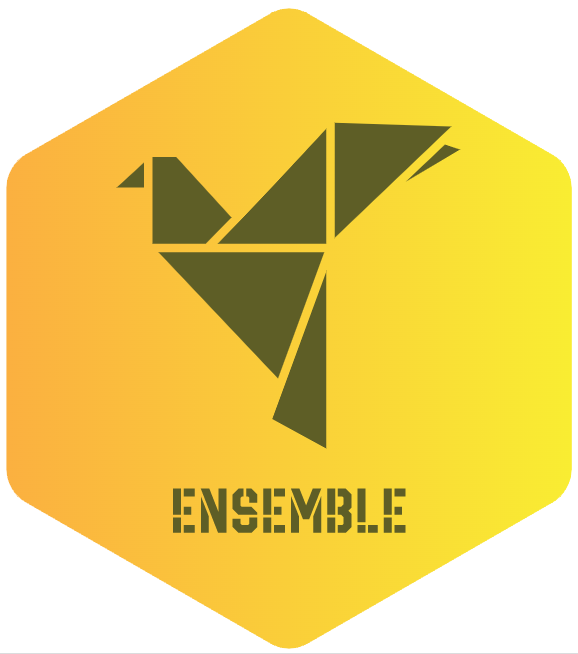

`ensemble` : An AutoML Algorithm for Building Homogeneous or Heterogeneous Stacked Ensemble Models by Searching for Diverse Base-Learners
=========================================================================================================================================

Building a successfult stacked ensemble models is based on two principles:

1. The base-learners are more accurate than a chance prediction. The more accurate the base-learners, the stronger the stacked ensemble
2. The base-learners are diverse, i.e. their error is not correlated. 

While the first principle is easy to assess with straight-forward model evaluation criteria, searching for _diverse excellent models_ is not that easy. The **`ensemble`** R package implements an auomated machine learning algorithm that identifies excellent - yet destinct - models and stacks them to build an excellent stacked ensemble model. 

> the repository is half-public and the code will be made publically available in the near future
